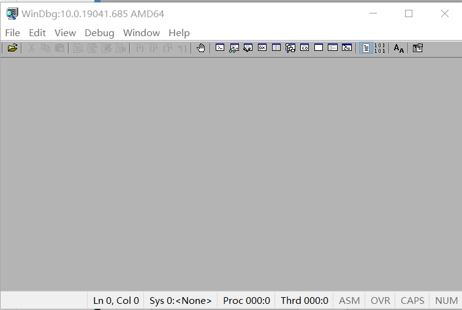
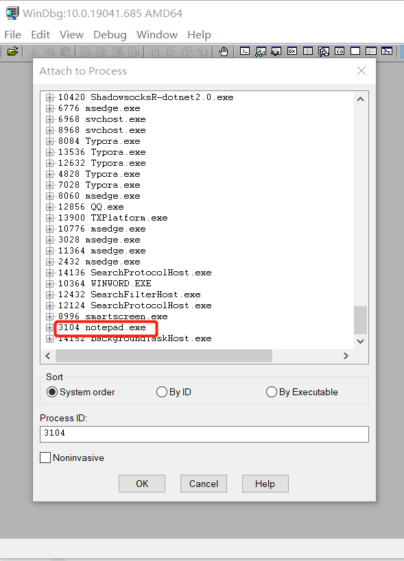
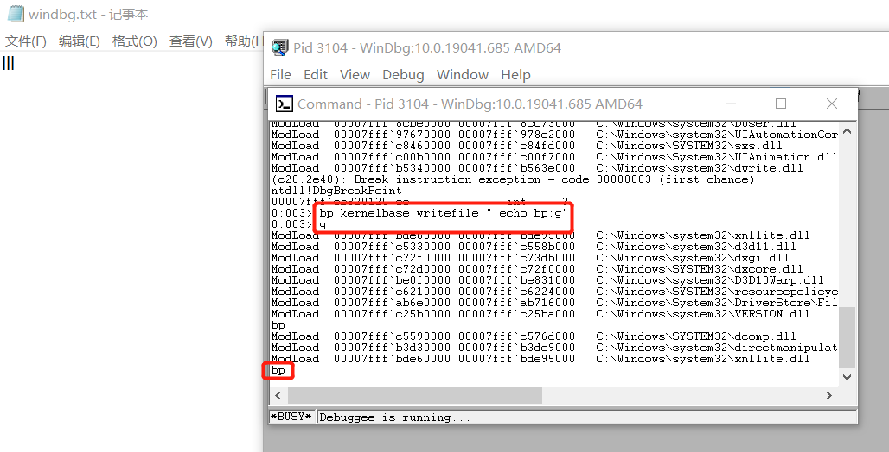
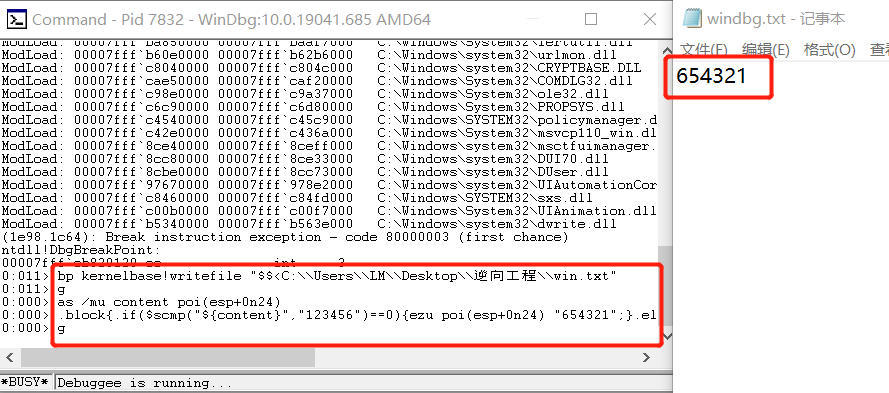

# Windebug实验报告

### 实验目的

+ 利用WinDbg篡改记事本行为，使得在记事本中输入“123456”，实际写入的内容是“654321”

### 实验原理

+ Windbg可用于调试内核模式和用户模式代码、分析故障转储以及在代码执行时检查 CPU 寄存器。相比较于Visual Studio，它是一个轻量级的调试工具，所谓轻量级指的是它的安装文件大小较小，但是其调试功能却比VS更为强大。因此，我们可以使用windbg对想要篡改的可执行文件进行调试，然后在关键步骤作出改动，例如，在本实验中，想要修改notepad实际显示的输出内容，就要在传参的时候将内容修改为想要输出的内容。

+ WinDbg使用基本命令
  + g命令：go，继续执行
  + b命令：断点
  + e(edit)：修改
  
+ WinDbg命令脚本

  WinDbg命令脚本，就是将完成某个特定任务的相关命令组合在一起，保存在脚本文件里，加载到Windbg里执行，达到目的

  具体使用方法：[Windbg命令脚本](https://www.cnblogs.com/yilang/p/11413230.html)

+ notepad在写入文件时使用的是kernelbase模块的writefile函数

### 实验过程

+ 首先在[官网](https://docs.microsoft.com/en-us/windows-hardware/drivers/debugger/debugger-download-tools)下载并安装WinDbg工具

  

+ 打开WinDbg，附加到notepad进程上以进行调试

  
  
+ 尝试下断点

  + 使用`bp kernelbase!writefile`命令来为程序下断点，kernelbase是writefile函数所在的模块名

  + 测试一下下断点是否成功，使用语句`bp kernelbase!writefile ".echo bp;g"`，表示若在记事本中写入数据，则Windbg命令行中会输出bp，如图，经测试，断点下成功了

    

+ 篡改记事本行为

  + 要实现将记事本内输入的内容‘123456’变为‘654321’（篡改内容需要和原内容长度相同），我们在命中断点后使用脚本执行命令，脚本内容：

    ```
    as /mu content poi(esp+0n24) <---将地址的内容保存到content变量
    .block{.if($scmp("${content}","123456")==0){ezu poi(esp+0n24) "654321";}.else{.echo content}} <---若content为123456，则将地址的内容修改为654321，否则在命令行输出content
    g
    ```

    该命令的意思是，若输入记事本的内容是‘123456’，就将其篡改为‘654321’，若不是就在命令行中输出内容

  + 运行结果

    + 在命令行内执行`bp kernelbase!writefile "$$<C:\\Users\\LM\\Desktop\\逆向工程\\win.txt"`
    + 在记事本内输入123456后，可以发现其内容变成了654321       

### 实验参考

+ [WinDbg 入门（用户模式） - Windows drivers | Microsoft Docs](https://docs.microsoft.com/zh-cn/windows-hardware/drivers/debugger/getting-started-with-windbg)
+ [Windbg命令脚本](https://www.cnblogs.com/yilang/p/11413230.html)
+ [ windbg修改notepad内容](https://blog.csdn.net/lixiangminghate/article/details/53086667?locationNum=3&fps=1)
+ [windbg 常用命令](http://www.gyarmy.com/post-413.html)

