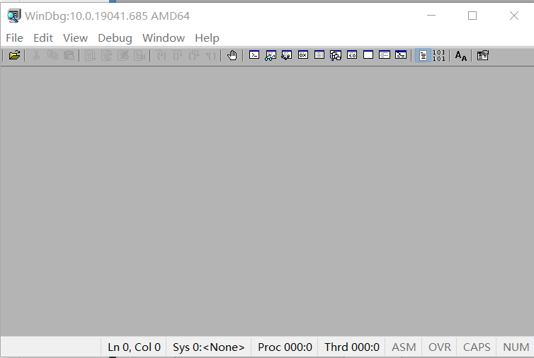
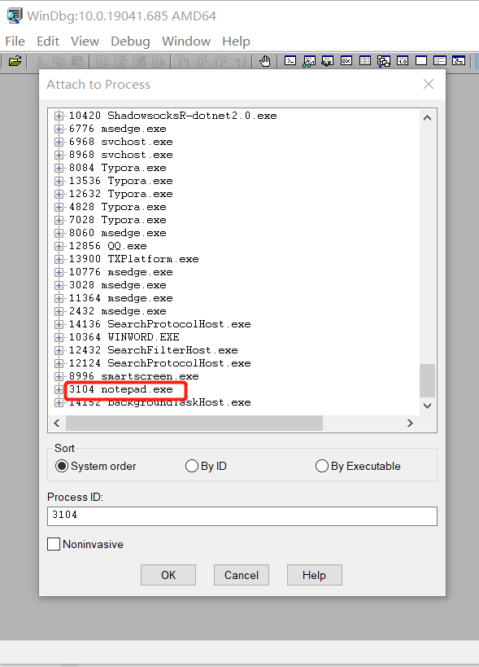
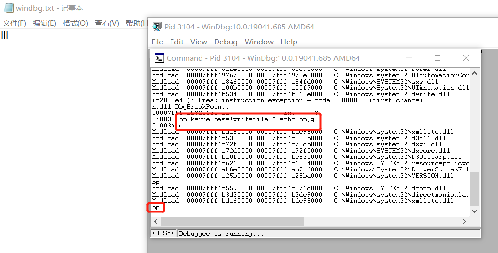

# Windebug实验报告

### 实验目的

+ 利用WinDbg篡改记事本行为，使得在记事本中输入“123”，实际写入的内容是“Be hacked！”

### 实验原理

+ Windbg可用于调试内核模式和用户模式代码、分析故障转储以及在代码执行时检查 CPU 寄存器。相比较于Visual Studio，它是一个轻量级的调试工具，所谓轻量级指的是它的安装文件大小较小，但是其调试功能却比VS更为强大。因此，我们可以使用windbg对想要篡改的可执行文件进行调试，然后在关键步骤作出改动，例如，在本实验中，想要修改notepad实际显示的输出内容，就要在传参的时候将内容修改为想要输出的内容。
+ WinDbg使用基本命令
  + g命令：go，继续执行
  + b命令：断点
+ notepad在写入文件时使用的是kernel32的writefile函数

### 实验过程

+ 首先在[官网](https://docs.microsoft.com/en-us/windows-hardware/drivers/debugger/debugger-download-tools)下载并安装WinDbg工具

  

+ 打开WinDbg，附加到notepad进程上以进行调试

  
  
+ 尝试下断点

  + 使用`bp kernelbase!writefile`命令来为程序下断点，kernelbase是writefile函数所在的模块名

  + 测试一下下断点是否成功，使用语句`bp kernelbase!writefile ".echo bp;g"`，表示若在记事本中写入数据，则Windbg命令行中会输出bp，如图，经测试，断点下成功了

    

+ 篡改记事本行为
+ 