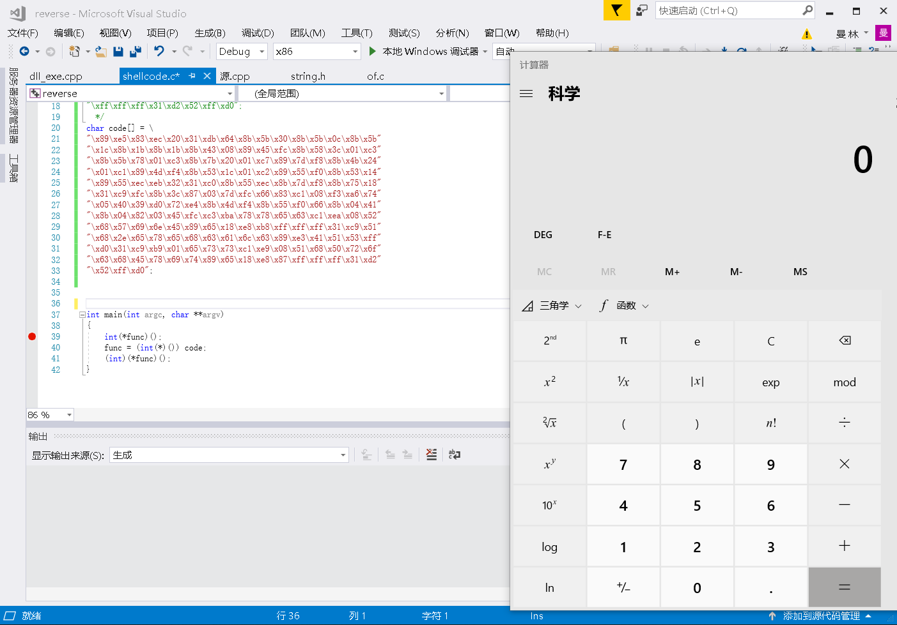
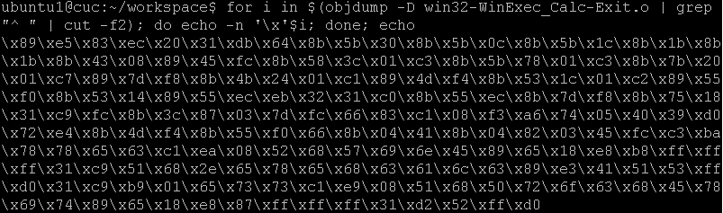
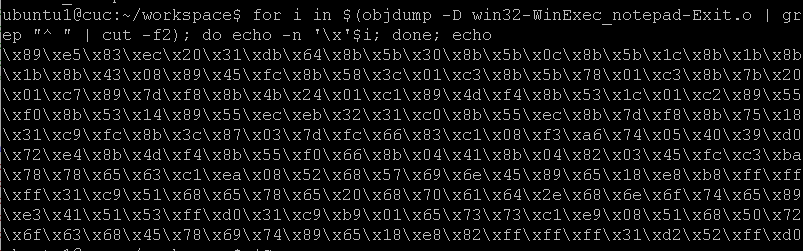
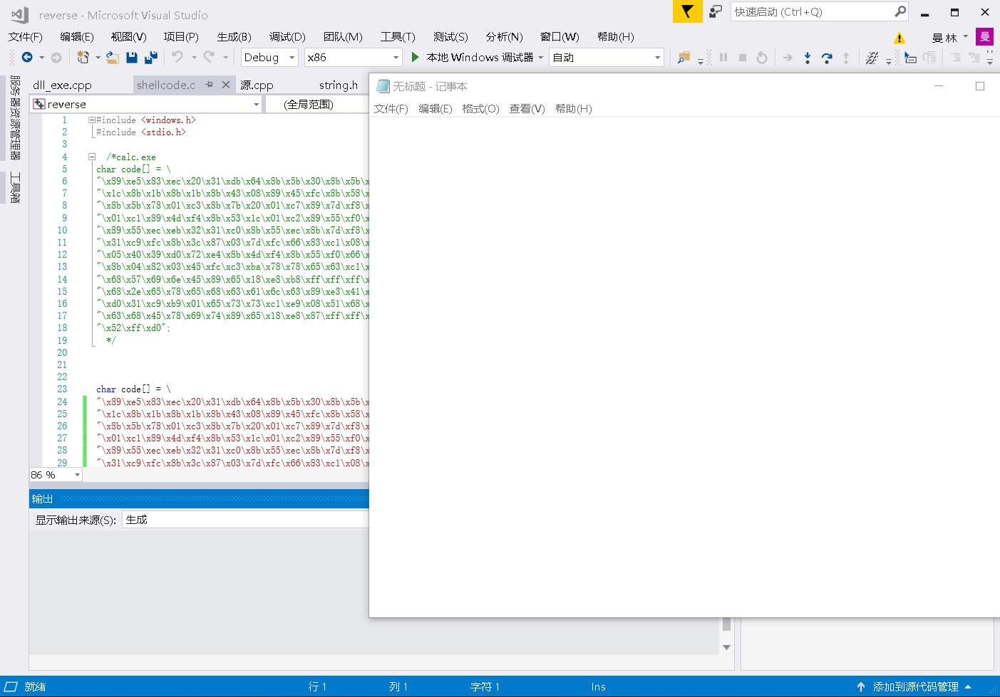

# 第四次实验
#### 将[链接](https://www.exploit-db.com/shellcodes/48116)中的shellcode成功运行


#### 能从汇编源码编译通过并成功dump
+ 在linux系统中下载nasm
+ 复制上述链接中的反汇编代码，在linux系统中存储为.asm结尾的文件
+ 运行语句
 ```
 nasm -f win32 win32-WinExec_Calc-Exit.asm -o win32-WinExec_Calc-Exit.o
; for i in $(objdump -D win32-WinExec_Calc-Exit.o | grep "^ " | cut -f2); do echo -n '\x'$i; done; echo
 ```

+ 得到运行计算器程序的shellcode

  
  
#### 自行查阅资料，搜索Windows PEB结构体，PE文件导入表导出表相关数据结构的文档，解读shellcode原理

+ PEB结构（Process Envirorment Block Structure）
```
typedef struct _PEB {
  BYTE                          Reserved1[2];
  BYTE                          BeingDebugged; //被调试状态
  BYTE                          Reserved2[1];
  PVOID                         Reserved3[2];
  PPEB_LDR_DATA                 Ldr;
  PRTL_USER_PROCESS_PARAMETERS  ProcessParameters;
  BYTE                          Reserved4[104];
  PVOID                         Reserved5[52];
  PPS_POST_PROCESS_INIT_ROUTINE PostProcessInitRoutine;
  BYTE                          Reserved6[128];
  PVOID                         Reserved7[1];
  ULONG                         SessionId;
} PEB, *PPEB;
```


#### 修改shellcode功能为运行记事本程序notepad. exe
+ 修改原链接汇编代码中与calc.exe有关的语句为
```
 push 0x20657865      ;  exe : 20657865
 push 0x2e646170       ; .dap : 2e646170
 push 0x65746f6e       ; eton: 65746f6e

```
+ 将修改了的代码在Liunx中使用nasm编译

+ 得到运行notepad.exe的shellcode

+ 运行

#### (选做，难度较大)修改shellcode功能为下载执行器，即下下载一个可执行文件，然后再运行（提示，使用原生API UrlDownloadToFileA）