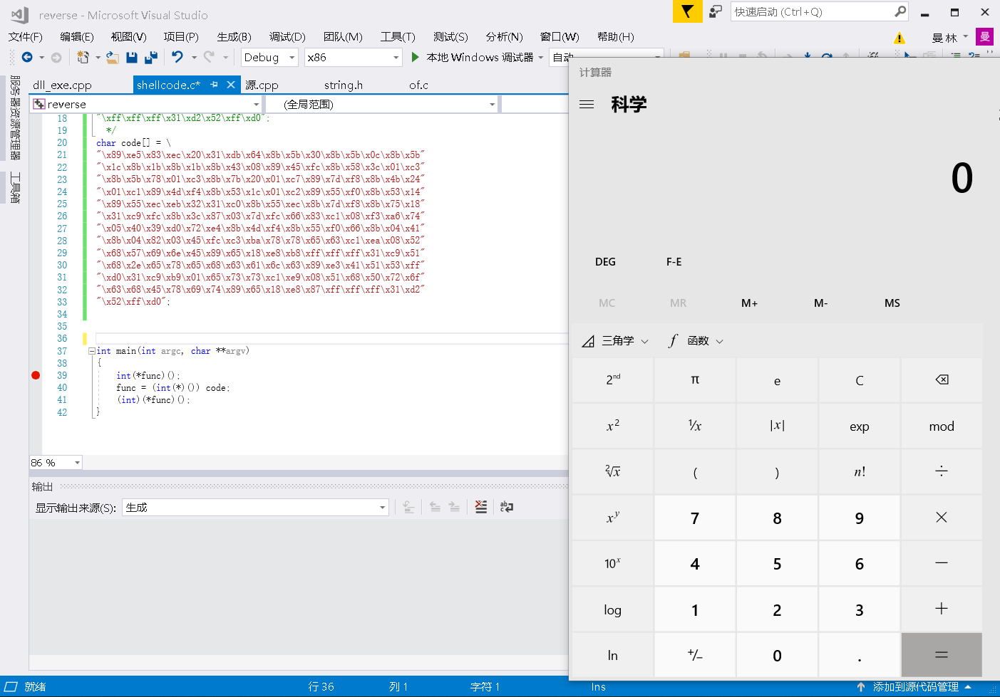
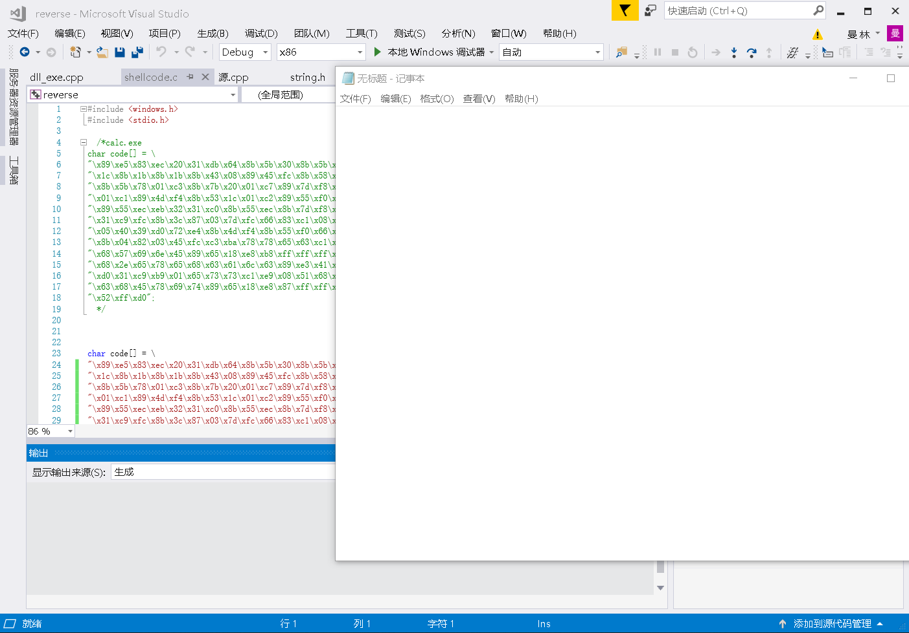

# shellcode实验

### 实验要求

-  将[链接](https://www.exploit-db.com/shellcodes/48116)中shellcode成功运行

+ 从汇编源码编译通过并成功dump
+ 自行查阅资料，搜索Windows PEB结构体，PE文件导入表导出表相关数据结构的文档，解读shellcode原理
+ 修改shellcode功能为运行记事本程序notepad. exe
+ (选做，难度较大)修改shellcode功能为下载执行器，即下下载一个可执行文件，然后再运行（提示，使用原生API UrlDownloadToFileA）

### 实验过程

##### 将[链接](https://www.exploit-db.com/shellcodes/48116)中的shellcode成功运行


##### 能从汇编源码编译通过并成功dump

+ 在linux系统中下载nasm
+ 复制上述链接中的反汇编代码，在linux系统中存储为.asm结尾的文件
+ 运行语句
 ```
 nasm -f win32 win32-WinExec_Calc-Exit.asm -o win32-WinExec_Calc-Exit.o
; for i in $(objdump -D win32-WinExec_Calc-Exit.o | grep "^ " | cut -f2); do echo -n '\x'$i; done; echo
 ```

+ 得到运行计算器程序的shellcode

  
  
##### 自行查阅资料，搜索Windows PEB结构体，PE文件导入表导出表相关数据结构的文档，解读shellcode原理

+ PEB结构（Process Envirorment Block Structure）

  PEB结构体记录了进程的各种信息，其结构体内容如下

  

+ [PE结构]([PE Format - Win32 apps | Microsoft Docs](https://docs.microsoft.com/en-us/windows/win32/debug/pe-format))
+ [Windows下通用ShellCode原理 ](https://b0ldfrev.gitbook.io/note/windows_operating_system/windows-xia-tong-yong-shellcode-yuan-li)

##### 修改shellcode功能为运行记事本程序notepad. exe

+ 修改原链接汇编代码中与calc.exe有关的语句为
```
 push 0x20657865      ;  exe : 20657865
 push 0x2e646170       ; .dap : 2e646170
 push 0x65746f6e       ; eton: 65746f6e

```
+ 将修改了的代码在Liunx中使用nasm编译

+ 得到运行notepad.exe的shellcode

+ 运行

#### 